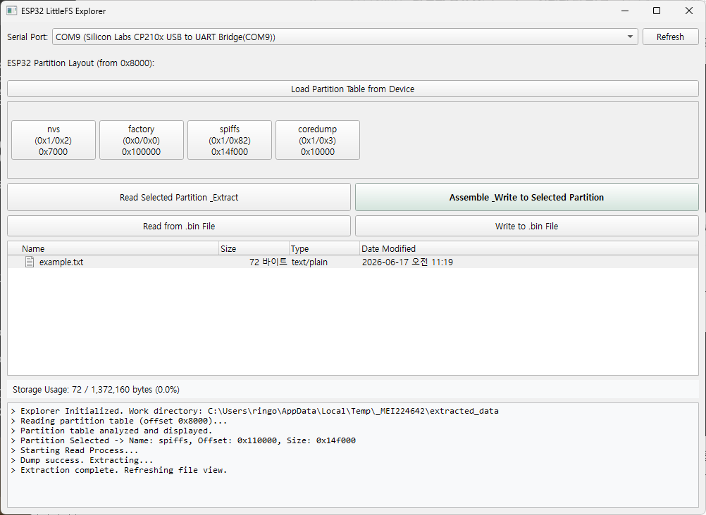

# ESP32 LittleFS Integrated Management Tool (LittleFS Toolset)

This project is a comprehensive suite of tools designed to **manage LittleFS file systems on ESP32 devices via an intuitive GUI**. It allows you to control the entire process—from partition analysis and file editing to device uploading—through a visual interface, eliminating the need for complex terminal commands or arguments.

<p align="center">
  
</p>

## Core Tool: LittleFS Explorer (`littlefs_explorer.py`)

`littlefs_explorer` is the main interface of the project, integrating various individual functions into a single, user-friendly application.

### Key Features
*   **Automatic Partition Table Analysis**: Reads the `0x8000` offset of the ESP32 device to analyze and display the partition layout as visual blocks. Users can easily identify and select the LittleFS partition.
*   **Direct Device Communication (Read/Write)**: Perform immediate data extraction (Dump) from the selected port/partition or write updated data back to the device (Flash).
*   **Real-time File Management (CRUD)**:
    *   Displays the internal file list of the LittleFS binary in a tree structure.
    *   Provides text editing capabilities by double-clicking files.
    *   Allows creating and deleting files/folders via a right-click context menu.
*   **Drag & Drop Support**: Easily add files to the file system by dragging them from your local PC's file explorer into the application window.
*   **Storage Monitoring**: Real-time monitoring of the actual file system usage compared to the partition size, with a visual red warning if the capacity is exceeded.

## Installation and Execution

### Requirements
*   **Python 3.x**
*   **Dependencies**: `esptool`, `littlefs-python`, `pyside6` (PySide6 is required for the GUI).

### Quick Start (Windows)
1.  Run the `venv_install.ps1` script to automatically set up the virtual environment and install required libraries.
2.  Once installed, run the application using:
    ```bash
    .\venv\Scripts\python.exe littlefs_explorer.py
    ```

## Project Structure

*   **GUI Editor**: `littlefs_explorer.py` (Main executable)
*   **Backend Scripts**: Individual modules responsible for LittleFS assembly/disassembly and device dump/flash.
*   **Test Code**: `src/main.cpp` for verifying LittleFS operation on the ESP32 device (Arduino environment).
*   **Image Resources**: Icons used for GUI buttons (`img/` folder).

## Reference Documents

*   Detailed functional specifications and CLI usage for individual scripts (`mklittlefs.py`, `dump_littlefs.py`, `flash_littlefs.py`, etc.) can be found in the **Scripts.ko.md** file (or the upcoming English version).

---

## Cautions
*   Since this tool writes data directly to the flash memory, ensure the correct serial port and partition offset are selected before proceeding.
*   Communication errors may occur if the device is currently occupied by another program (e.g., Arduino IDE Serial Monitor).

---
Copyright (c) 2024 ESP32 LittleFS Toolset Project
License: MIT